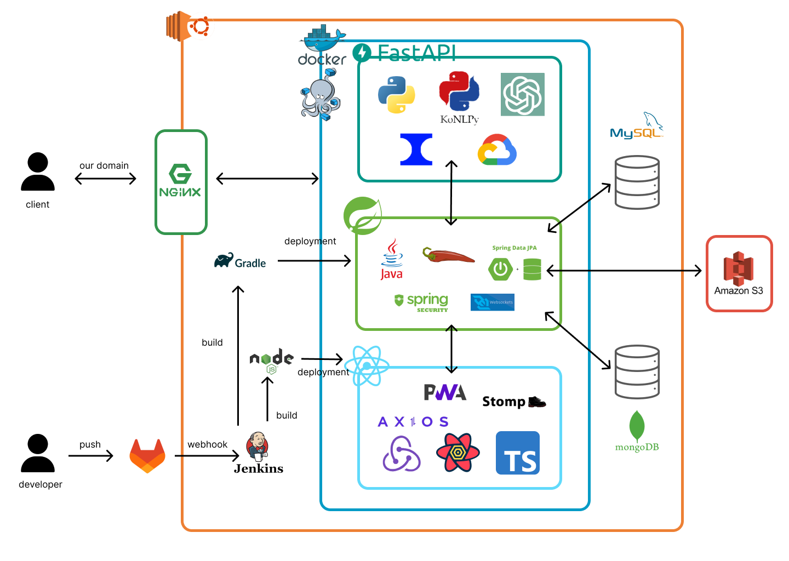
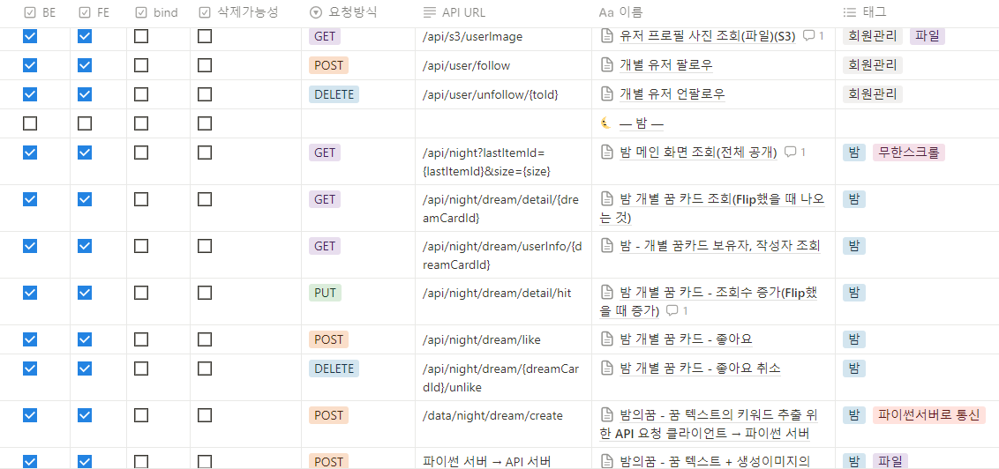
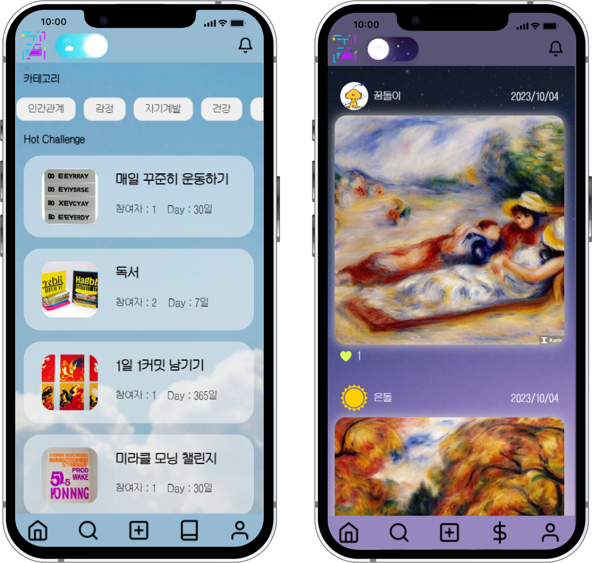
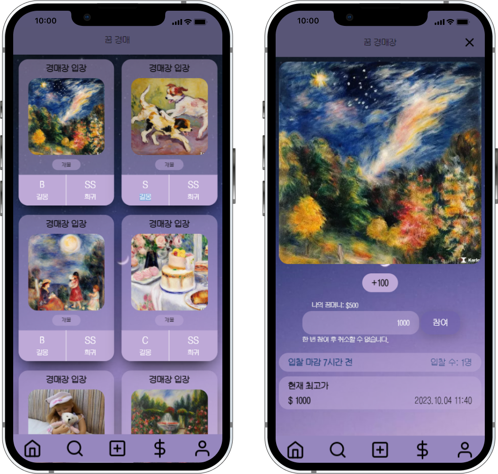
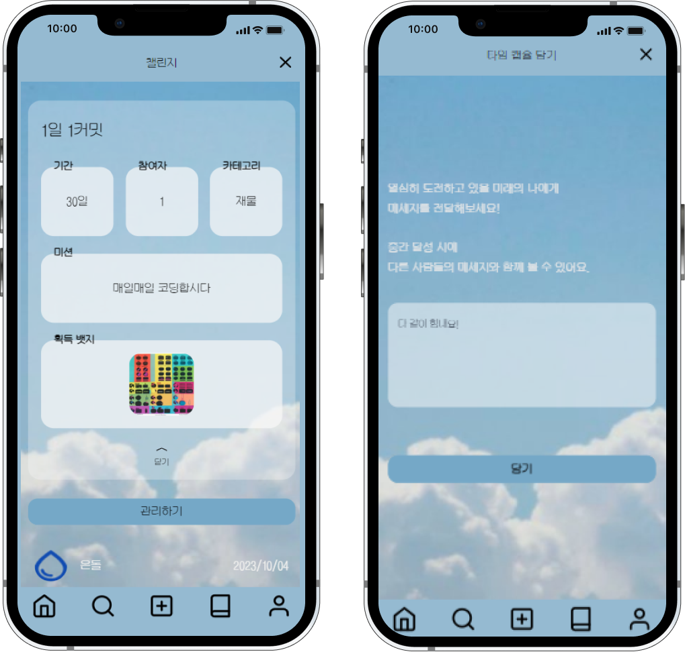

# 꿈을 통해 미래를 만들어가다, [꿈틀]

### 1️⃣ 프로젝트 개요

📌 **개발 기간**

| 개발 기간 | 2023.08.28 ~ 2023.10.06 (6주)
| --- | --- |

---

📌 **팀원 소개**

| 팀원 | 역할 | 
| --- | --- |
| 김선진 | 팀장, BE, Infra, 알고리즘 |
| 최범선 | BE, Data 적재 |
| 황윤영 | BE |
| 변민지 | FE, Data 크롤링 |
| 이은석 | FE |
| 신동민 | FE, Data 처리, 이미지 생성 |

---

📌 **기획 의도**

| 꿈은 무의식을 표현하는 수단! |
| --- |

| 무의식을 분석해서 더 나은 하루를 만들 수 있지 않을까..? |
| --- |

---

📌 **목표**

| 사용자가 입력한 꿈을 분석하여 해몽하고 그림을 생성한다.|
| --- |

| 생성한 그림으로 경매를 열어 다른 유저들과 꿈을 주고 받는다. |
| --- |

| 꿈에서 추출된 키워드를 통해 낮에 꾸는 꿈, 즉 챌린지를 추천한다. |
| --- |

| 유저들과 챌린지를 함께 참여함으로써 동기부여를 얻는다. |
| --- |

---

### 2️⃣ 서비스 소개

📌 **주요 기능 : 꿈 분석**

- 음성 또는 텍스트를 통해 꿈 데이터 입력
- 보유하고 있는 데이터에 존재하는 것과 가장 가까운 꿈을 찾음
- 문자열 유사도, 감정 분석 등의 가중치 사용

📌 **주요 기능 : 꿈 카드**
- 입력 받은 꿈 텍스트를 기반으로 키워드 추출
- 추출된 키워드로 생성형 AI 모델 카를로로 이미지 생성
- 긍정적인 정도인 길몽도, 희귀한 정도인 희귀도 세분화하여 제공

📌 **주요 기능 : 꿈 카드 경매**
- 생성된 꿈 카드를 다른 유저와 주고 받음

📌 **주요 기능 : 챌린지**
- 챌린지 참여를 통해 유저들과 목표를 이루어 나감
- 매일 인증글을 등록할 수 있음
- 좋아요 및 댓글 작성을 통한 반응

---

### 3️⃣ 아키텍처

---

### 4️⃣ 기술 스택

- Back-End
  - Java
  - Spring Boot
  - Spring JPA
  - Spring Security
  - Stomp
- Front-End
  - React
  - Redux
  - Redux-Persist
  - TypeScript
  - Node.js
  - Axios
  - Stomp.js
  - Styled-components
- Data
  - Python
  - BeautifulSoup
  - Selenium
  - Fast API
  - KoNLPY
  - Google-cloud-language
  - Karlo
- Infra
  - Docker
  - Ngnix
  - Jenkins
  - Amazon S3
- DB
  - MySQL
  - MongoDB
- Community
  - Gitlab
  - Jira
  - Notion
  - Figma
  - Mattermost
  - Webex

---

### 5️⃣ ERD

---

### 6️⃣ API 명세

---

### 7️⃣ 서비스 화면

- 메인 

 

- 경매 

 

- 챌린지 

